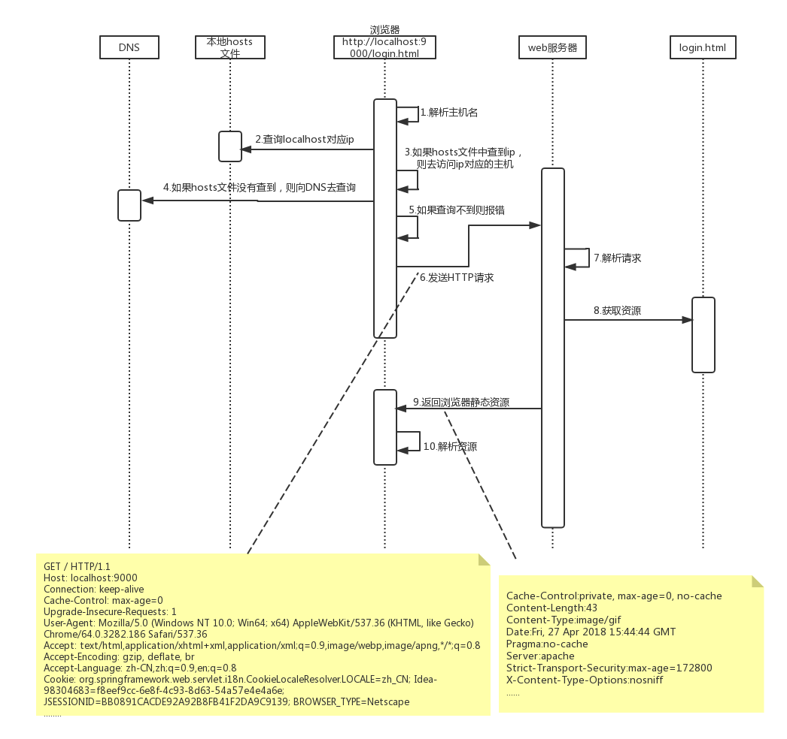

# 编写一个apache服务器

## 时序图
 
## 应用的技术：
### http

### socket

### 流

### Thread

### ThreadPool

 ```java
public class A{
    public static void main(String[] args){
        //固定大小的线程池
        ExecutorService executorService = Executors.newFixedThreadPool(10);
        //一个单线程的线程池
        ExecutorService e1 = Executors.newSingleThreadExecutor();
        //一个可缓存的线程池
        ExecutorService e1 = Executors.newCachedThreadPool();
        //大小无限的线程池,支持定时以及周期性执行任务的需求
        
    }
    
}
```   

### Queue

    Queue：先入先出（FIFO）的数据结构
    Queue接口与List、Set同一级别，都是继承了Collection接口。LinkedList实现了Deque接口。

不阻塞队列:

    PriorityQueue 类实质上维护了一个有序列表。加入到 Queue 中的元素根据它们的天然排序（通过其 java.util.Comparable 实现）或者根据传递给构造函数的 java.util.Comparator 实现来定位。
    ConcurrentLinkedQueue 是基于链接节点的、线程安全的队列。并发访问不需要同步。因为它在队列的尾部添加元素并从头部删除它们，所以只要不需要知道队列的大 小，ConcurrentLinkedQueue 对公共集合的共享访问就可以工作得很好。收集关于队列大小的信息会很慢，需要遍历队列。
    
阻塞队列:
    
    * ArrayBlockingQueue ：一个由数组支持的有界队列。
    * LinkedBlockingQueue ：一个由链接节点支持的可选有界队列。
    * PriorityBlockingQueue ：一个由优先级堆支持的无界优先级队列。
    * DelayQueue ：一个由优先级堆支持的、基于时间的调度队列。
    * SynchronousQueue ：一个利用 BlockingQueue 接口的简单聚集（rendezvous）机制。
操作：

    add        增加一个元索                     如果队列已满，则抛出一个IIIegaISlabEepeplian异常
    remove   移除并返回队列头部的元素    如果队列为空，则抛出一个NoSuchElementException异常
    element  返回队列头部的元素             如果队列为空，则抛出一个NoSuchElementException异常
    offer       添加一个元素并返回true       如果队列已满，则返回false
    poll         移除并返问队列头部的元素    如果队列为空，则返回null
    peek       返回队列头部的元素             如果队列为空，则返回null
    put         添加一个元素                      如果队列满，则阻塞
    take        移除并返回队列头部的元素     如果队列为空，则阻塞

# 深入理解jsp-servlet原理